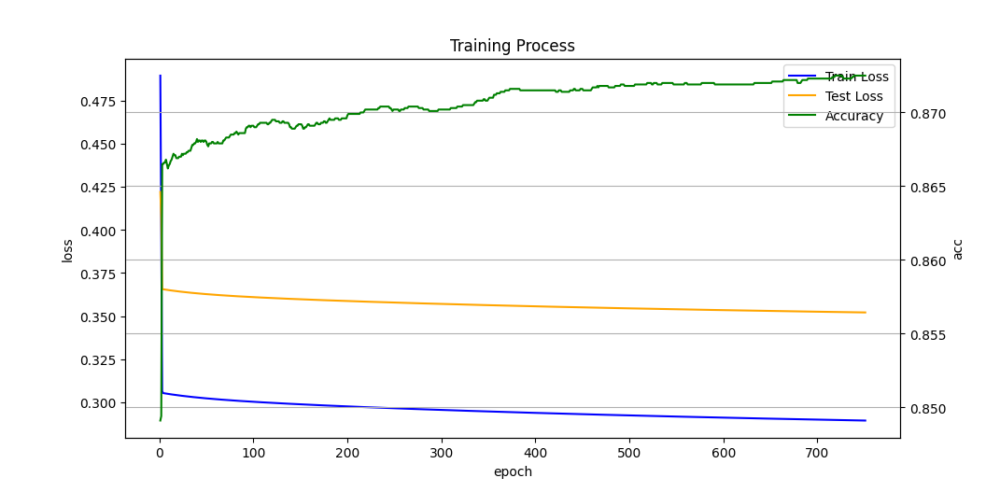
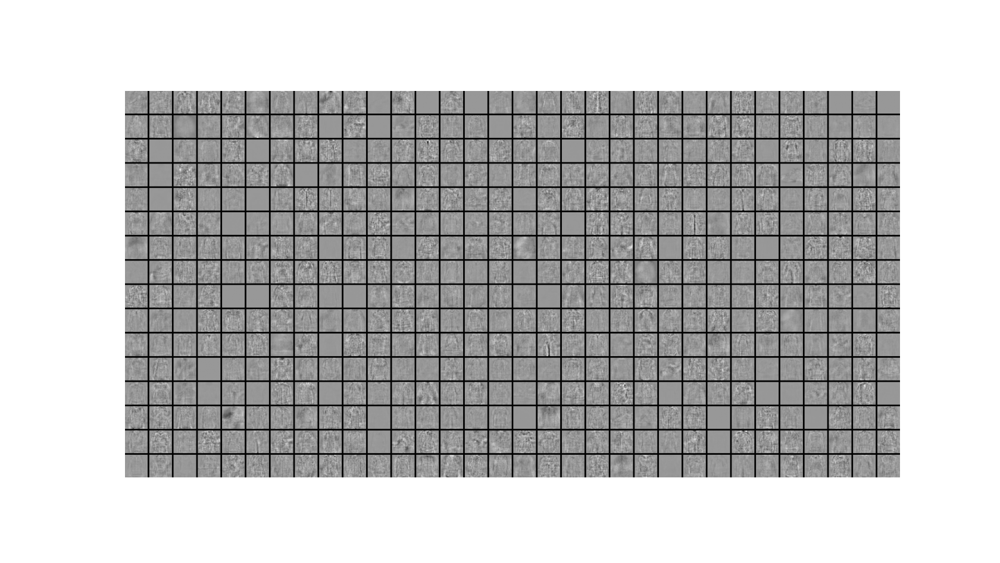
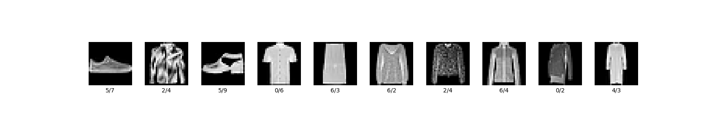

# 简单神经网络Demo

## 配置环境
### Dependence
- python 3.12
- numpy
- cupy (如果需要使用GPU加速，默认开启，可在config.py中关闭)
### 使用conda启动
```bash
conda create -p ./.conda python=3.12
conda activate ./.conda
pip install numpy
```

对于Cuda用户
```bash
pip install "cupy-cuda12x[ctk]"
```
对于ROCm用户
```bash
HCC_AMDGPU_TARGET=gfx906(替换成你的GPU架构) CUPY_INSTALL_USE_HIP=1 ROCM_HOME=/opt/rocm pip install cupy
pip install cupy-rocm-7-0 # 或者使用预编译包（依赖rocm7）
```

### 数据集下载
从github下载fashion-mnist-master,解压到./fashion_mnist_master

## 关于代码
### 代码文件结构
- `nn` 需要调用的函数/类的打包
- `nn.funcs` 函数计算/梯度计算
- `nn.modeling` 模型建模相关/预测计算/反向传播
- `nn.training` 模型训练器
- `nn.loading` 模型参数的存储与加载
- `nn.config` 控制是否使用GPU加速
- `main.py` fasion-mnist分类器
- `test_simple.py` 简单异或分类问题测试程序

### 代码风格
变量名使用蛇形命名，函数名使用小驼峰，类名使用大驼峰。（可能会有部分有所疏漏）

### 神经网络声明
所有的神经网络层都继承自`nn.modeling.Layer`类，目前内置的层包含`SoftMax` `Sigmoid` `ReLU` `BaseLayer` `LayerStack`，一个神经网络模型即为一个`LayerStack`层，允许`LayerStack`进行嵌套，由于参数储存格式目前不允许自定义层（可以使用生成器函数来替代）。

### 参数保存
通过`loading`模块进行参数储存，储存为专有的`.nnpt`格式。加载和存储都包装为函数，详细请查阅`loading.py`。

### 进行训练
通过`training`模块进行训练，目前支持使用固定学习率和带预热的指数衰减自适应学习率两种训练器。

## Mnist Fashion 全连接10分类器
### 进行训练
```bash
python main.py
```

### 超参数自调整
```bash
python main_advanced.py
```

### 后期微调训练
```bash
python main_second.py
```

### 验证
```bash
python main_verify.py
```

## 实验报告
### 模型结构
ReLU全连接层(768x512)=>ReLU全连接层(512x256)=>Softmax全连接输出层(256x10)

### 数据集处理
所有的数据集会以768维向量flatten的形式输入，输出处理为10维One-Hot向量，分别对应10个分类

### 实验结果
最优权重已经存储在`best_0.9021.nnpt`中，该权重可以在测试集上达到`90.21%`的正确率。
它的基础训练超参数是`layer1=512, layer2=256, lr_max=1, lr_min=1e-5, l2=1e-4, lr_delta=0.95`\
后期使用`main_second.py`进行了微调

### 收敛可视化


### 权重可视化
对第一层参数进行可视化:\

可以发现大部分的图像都具有衣服的外形，可能是对所有服装图像起到一个范围筛选的作用。有少部分可以发现有裤子的外形，有一些地方可以感觉到像衣服的带子之类的，可能是特征信息提取。

### 错例分析
对前10个错例进行可视化:\

第一张图将运动鞋错认成了凉鞋，第二张图将外套识别成套头衫，第三张图将短靴认成了凉鞋，第四张图将衬衫认成了T恤，第五张图将连衣裙识别为套衫，第六张图将套头衫识别为衬衫，第七张图将外套识别为套头衫，第八张图将外套识别为衬衫，第九张图将套头衫识别为T恤，第十张图将连衣裙识别为外套。
可以发现大体上衣服类别并没有识别错误的情况，主要是同一大类不同类别衣物之间的相似性导致的识别错误，可能是模型层数不够，学习能力不够强，以及图像分辨率低导致的。